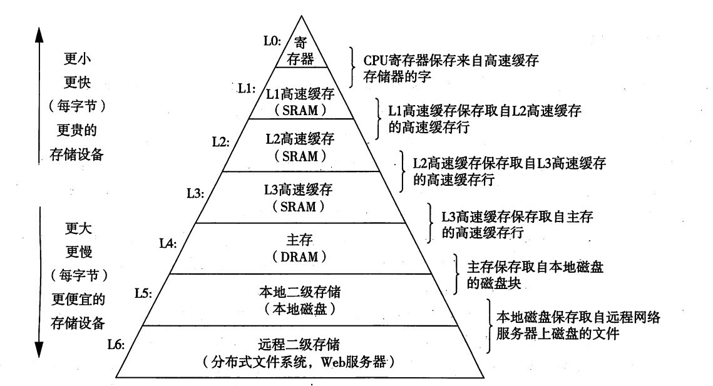

# CPU位数

CPU位数是指CPU一次能处理的二进制数的最大位数。这是体系结构（CPU架构）决定的。

我们所说的32位处理器，指的是CPU内部的通用寄存器的宽度为32位，一次能处理的最大位数为32位(一次处理4个字节)，它的地址总线位数为32位 (地址总线位数决定了CPU的寻址能力)。

可寻址物理地址范围为4GB(2^32byte= 4GB) 。4GB即4G个字节，CPU可寻址4G个地址，根据内存地址访问内存的存储单元。

内存地址由计算机操作系统分配，每一个字节分配一个内存地址,，cpu只需要知道某个数据类型的地址, 就可以直接去到读影的内存位置去提取数据(这里的"直接"，指直接寻址技术)。

由此可知，32位的操作系统(32位处理器或64位处理器的计算机才能装32位操作系统)，即使配上8GB内存，操作系统最多也只能给其中4GB分配地址。(实际能被操作系统访问到的一般是3.2GB左右，有一部分会被显卡缓存等占用)

CPU发展迅猛，从零几年开始CPU就全都是64位的了，64位CPU理论上最多支持16EB内存，可理解成近似于无限大。

CPU通过MMU(内存管理单元)访问内存

> CPU 在访问内存的时候都需要通过 MMU 把虚拟地址转化为物理地址，然后通过总线访问内存。MMU 开启后 CPU 看到的所有地址都是虚拟地址，
> CPU 把这个虚拟地址发给 MMU 后，MMU 会通过页表在页表里查出这个虚拟地址对应的物理地址是什么，从而去访问外面的 DDR（内存条）。
内存的存取速度比中央处理器操作速度要慢得多，使CPU的高速处理能力不能充分发挥，整个计算机系统的工作效率受到影响。

不同存储器访问时间差异很大，离CPU越近的存储器，速度越快，每字节的成本越高，容量也因此越小。

CPU中的寄存器速度最快，离CPU最近，成本最高，所以个数容量有限，其次是高速缓存（分级），再次是主存、磁盘。

计算机存储体系结构图：

高速缓冲存储器cache，用来提高CPU访问内存的速度，L1、L2、L3都属于高速缓存。
使用高速缓存的过程成为缓存，cache的效率由命中率来衡量，一个好的cache效率通常在80%-95%的命中率。